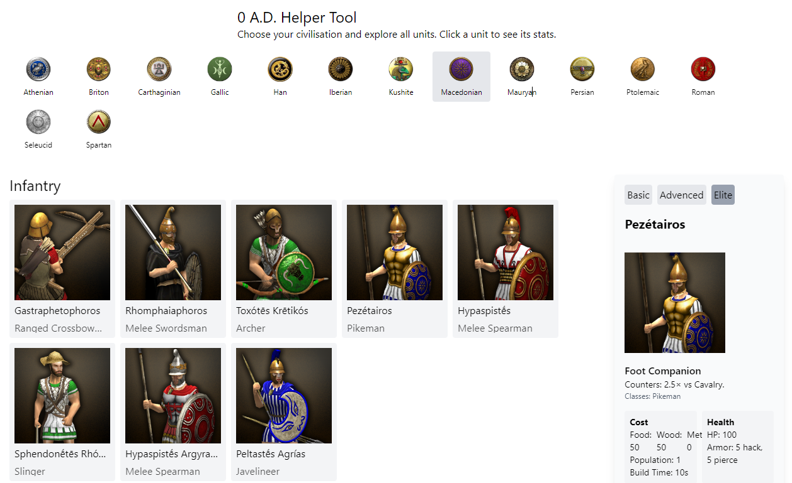

# 0ad-tool



## Workflow

### Extract Unit Data from Game Files

To clean up data XML files and remove cached files, run:

```sh
find . -type f -name '*.cached.xmb' -delete
```

#### Unit Icons

Unit icon path:

```
binaries/data/mods/public/art/textures/ui/session/portraits/units
```

[Browse icons on Gitea](https://gitea.wildfiregames.com/0ad/0ad/src/branch/main/binaries/data/mods/public/art/textures/ui/session/portraits/units)

## Development

To build Tailwind CSS in watch mode:

```sh
npx @tailwindcss/cli -i styles/input.css -o styles/output.css --watch
```